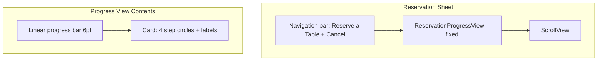

# Reservation Progress Bar Placement – Planning

## Current State

The progress indicator in [ReservationSheetView.swift](Restaurant Demo/ReservationSheetView.swift) is **fixed at the top** of the sheet, directly below the navigation bar and above the scrollable content.

**Visual hierarchy:**
1. Nav bar (inline title)
2. Progress: thin bar + card with When | Party | Contact | Confirm
3. ScrollView with step content (hero, cards, buttons)

---

## Why It May Feel Wrong

1. **Competes with the title** – Progress sits between the nav bar and content. On small screens this uses significant vertical space before the user reaches the form.
2. **Disconnected from the step** – The progress is visually separate from the step content. When the user scrolls to fill in date/time, the indicator stays "up there" and can feel unrelated.
3. **Heavy for a sheet** – The full card (circles, labels, connectors) plus a separate progress bar may feel bulky at the top of a modal flow.
4. **Auth flow differs** – [AuthFlowViews.swift](Restaurant Demo/AuthFlowViews.swift) uses a similar top placement for `OnboardingProgressView`, but the auth flow uses full-screen pages, not a scrollable sheet. The reservation sheet is denser and scrollable, so the same pattern may not fit.

---

## Alternative Placement Options

### Option A: In the Navigation Bar (Compact)

Move progress into the nav bar as a compact element: e.g. a subtitle like "Step 1 of 4" or a thin progress bar under the title.

**Pros:** Saves vertical space; progress lives with chrome; familiar pattern (e.g. checkout flows).
**Cons:** Less visual emphasis; hard to show step names (When, Party, etc.) without crowding the bar.

**Implementation:** Use `.toolbar` with a custom `ToolbarItem` or navigation bar subtitle; or a thin bar in a custom nav bar background.

---

### Option B: Above Step Content, Inside ScrollView

Place the progress at the top of the ScrollView content so it scrolls with the form.

**Pros:** Progress feels part of the flow; scrolls away to give more room for long steps (e.g. calendar).
**Cons:** Progress disappears when user scrolls down; can feel like it "leaves" the user.

---

### Option C: Below the Step Hero, Above the Cards

Put the progress between the StepHeroHeader ("When are you coming?") and the input cards for each step.

**Pros:** Contextually tied to the current step; user always sees "this is step X" right before the inputs.
**Cons:** Layout differs per step; progress moves down the screen as content grows; might feel inconsistent.

---

### Option D: Above the Next/Back Buttons (Bottom-Anchored)

Keep the progress fixed near the bottom, just above the step action buttons.

**Pros:** Visible when the user is about to tap Next/Back; reinforces "you're about to advance."
**Cons:** User might not see it until they scroll down; less prominent for orientation.

---

### Option E: Simplified Top (Bar Only, No Step Circles)

Replace the current design with a **thin progress bar only** at the top (no circle + label card). Optionally show "Step 1 of 4" as small text next to it.

**Pros:** Cleaner, less visual weight; still provides orientation.
**Cons:** Loses the explicit step names (When, Party, etc.).

---

### Option F: Sticky Header (Progress Sticks When Scrolling)

Place progress at the top of the ScrollView but make it **sticky**: it scrolls initially, then sticks below the nav bar when the user scrolls down.

**Pros:** Visible at start; stays in view as user scrolls without taking permanent top space.
**Cons:** More complex (requires `ScrollView` + overlay or `GeometryReader`); iOS has no built-in "sticky" for arbitrary views.

---

## Recommendation

Two strong options:

1. **Option A (Nav bar)** – Best for maximizing space and a cleaner sheet. Use a compact "Step 1 of 4" or thin bar.
2. **Option E (Bar only)** – If keeping progress at the top, simplify to a thin bar and remove the step circles card to reduce clutter.

---

## Questions to Clarify

Before implementing, it would help to know:

1. **What feels wrong specifically?** (Too high? Too bulky? Disconnected from content? Something else?)
2. **Do you want to keep the step names** (When, Party, Contact, Confirm) visible, or is a simpler "Step X of 4" enough?
3. **Preferred direction:** More compact (nav bar or bar-only) vs. more integrated (inline with step content)?
